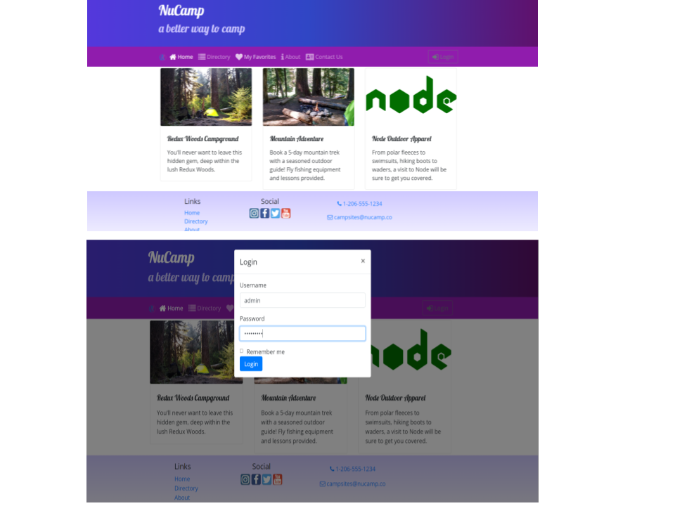
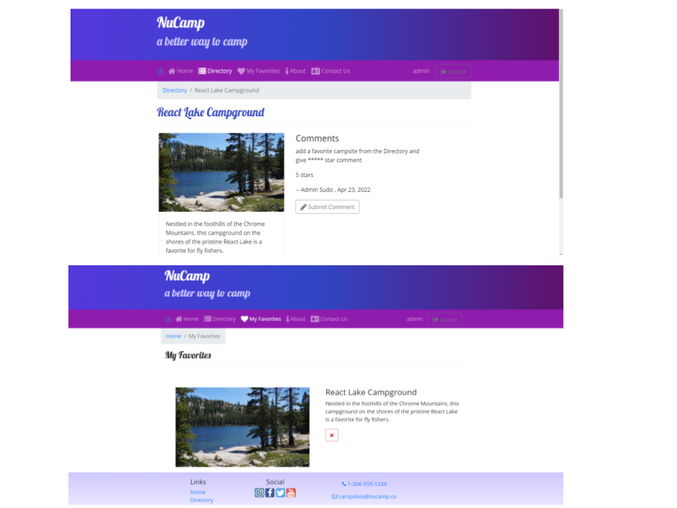

# Nucampsite  MERN Project

## Table of contents
* [General info](#general-info)
* [Summary](#summary)
* [Technologies](#technologies)
* [Backend github](#backend-github)
* [Contact](#contact)

## General info
* Full stack web application utilizing the MERN stack: MongoDB, Express.js, React, and Node.js. 
* Authorization and authenication implemented with JWT.
* Front-End styles using class based component life cycles.
* Users can create account through application. 
* Only Users can add My favorites and submit cooments(for Demo: username-admin , password-passwprd)
* Interact with the campsites favorites and  utilizing the comments feature. 
* For testing: username- admin, password- password

Welcome to Nucampsite. 

 

<kbd>

</kbd>

 

<kbd>

</kbd>

## Summary
This project took me 6 months to finish and working along with Nucamp Bootcamp classmates, instructors and mentors. I learned a lot how forntend and backend works and connects each other.
Please feel free to give some feedbacks and advices.

## Technologies

### Frontend Development 
* JavaScript 
* HTML
* CSS
* bootstrap- 4.5.2
* bootstrap-social- version 5.1.1
* font-awesome- version 4.7.0
* prop-types- version 15.7.2
* react- version ^16.13.1
* react-animation-components- version 3.0.0
* react-dom- version ^16.13.1
* react-popper- version 1.3.6
* react-redux- version 7.2.0
* react-redux-form- version 1.16.14
* react-router-dom-version  5.2.0
* react-scripts- version 3.4.1
* reactstrap- version 8.5.1
* redux- version 4.0.5
* redux-logger- version 3.0.6
* redux-thunk- version 2.3.0
* typeface-lobster- version ^0.0.72
* typeface-open-sans- version ^0.0.*  

### Backend Development 
* cookie-parser- version 1.4.4
* cors- vesrion 2.8.5
* debug- vesrion 2.6.9
* express- vesrion 4.16.1
* express-session- vesrion 1.17.1
* http-errors- vesrion 1.6.3
* jade- vesrion 1.11.0
* jsonwebtoken- vesrion 8.5.1
* mongoose- vesrion 5.10.9
* mongoose-currency- vesrion 0.2.0
* morgan- vesrion 1.9.1
* multer- vesrion 1.4.2
* passport- vesrion 0.4.1
* passport-facebook-token- vesrion 4.0.0
* passport-jwt- vesrion 4.0.0
* passport-local- vesrion 1.0.0
* passport-local-mongoose- vesrion .0.1
* session-file-store- vesrion 1.5.0

## Backend github
https://github.com/JosephThawn/nucampsiteServer.git 

## Contact
Created by [Pau Thawn](https://www.linkedin.com/in/pau-thawn) 
Feel free to contact me for any questions! 

